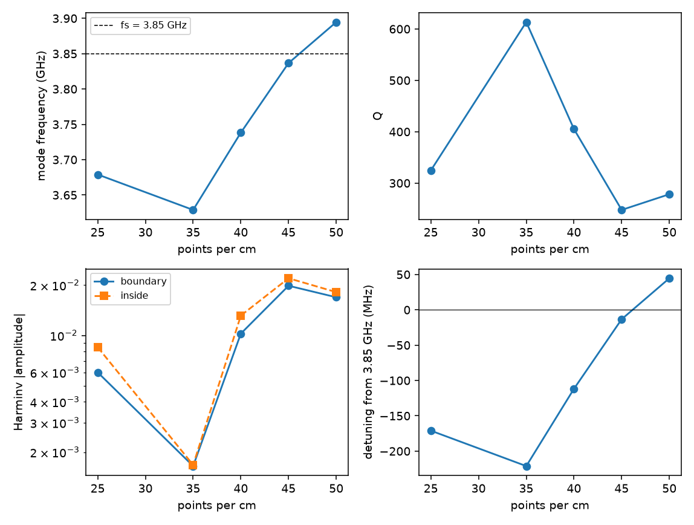
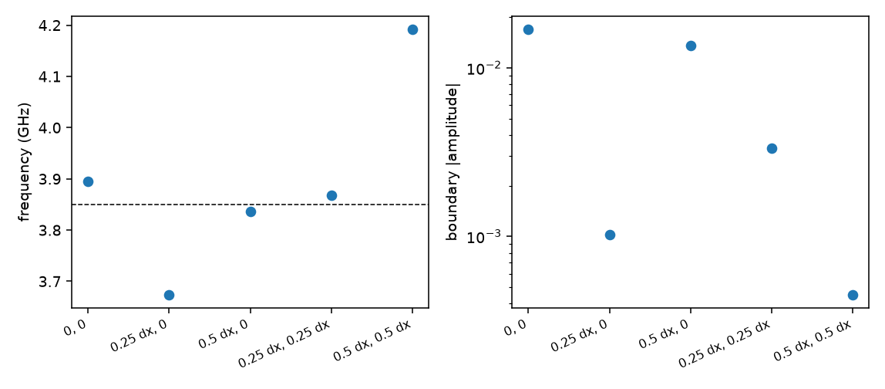
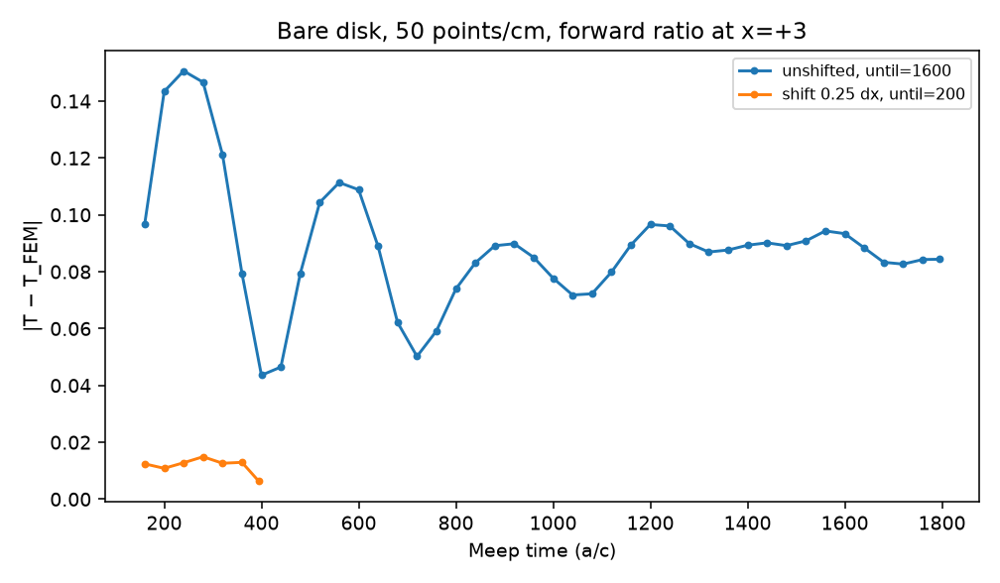
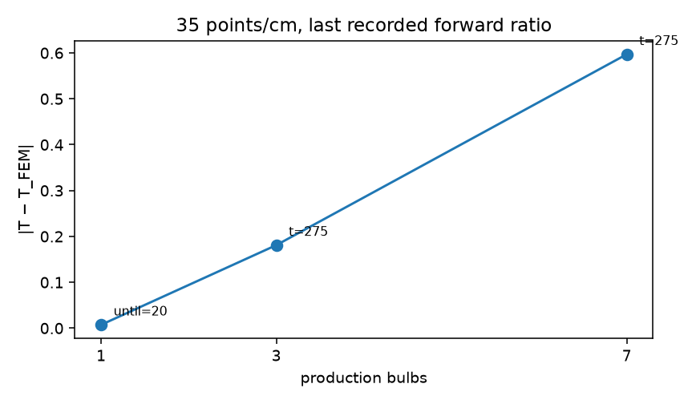

# Plasma-ring campaign

**GRID_DEPENDENT_BOUNDARY_MODE**
**CURVED_DRUDE_INTERFACE_ERROR**
**TEMPORAL_DFT_NOT_CONVERGED**

Update after the seven-bulb long run. The same seven-bulb geometry, continued to 1600 time units after the source, does not return to FEM. The complex forward error settles near 0.45 (−0.6 dB, −15°) and stays there. A 0.25-cell shift of that whole cluster drops the late error to about 0.05. The full record is in `SEVEN_BULB_LONGTIME.md`. The paragraph below is the earlier bare-disk conclusion and is unchanged.

The late field on the bare curved plasma boundary is a discrete Yee mode. Its frequency walks through 3.85 GHz as the grid is refined, and a half-cell shift moves it by hundreds of megahertz and changes its amplitude by more than ten. It is not the broad continuum Mie feature near 5.25 GHz. On the default 50 points/cm registration a run lasting about four decay times still sits +0.15 dB and +4° off the FEM/Mie forward ratio. The same physical disk, shifted by 0.25 cell, returns to that continuum value within 0.05 dB. Quartz does not remove the mode. From 1 to 7 bulbs the mode Q does not grow; the unfinished target-frequency error at a fixed short time does grow. A 19-bulb run was not justified. No 91-bulb run was launched.

Resolution in this report is **points per centimeter**. `dx_mm = 10 / points_per_cm`. With the Meep length `a = 0.020 m`, the Meep `resolution` argument is `2 × points_per_cm`. Free-space wavelength at 3.85 GHz is 77.87 mm. Those three quantities are not interchangeable.

| points/cm | dx (mm) | Meep resolution | cells per 20 mm | cells per λ0 (3.85 GHz) |
|---:|---:|---:|---:|---:|
| 25 | 0.400 | 50 | 50 | 195 |
| 35 | 0.286 | 70 | 70 | 273 |
| 40 | 0.250 | 80 | 80 | 311 |
| 45 | 0.222 | 90 | 90 | 350 |
| 50 | 0.200 | 100 | 100 | 389 |
| 60 | 0.167 | 120 | 120 | 467 |

60 points/cm was defined and not run. The source band used by Harminv's own check is about 3.46–4.24 GHz.

## What was kept fixed

B = 0. Plasma response is the Meep Drude value at each frequency, ε(3.85 GHz) = −3.3178 + 0.00112i. Bare-disk radius 0.230 a. Production bulb: plasma core, vacuum gap, 1.00 mm quartz (ε = 3.8), ID/OD 13/15 mm. Point-source Hz at x = −6, forward ratio at x = +3, source and monitors shifted with the geometry. FEM references are the existing body-fitted solves (disk, one bulb, 3-bulb, 7-bulb). The only code fix was the post-solve `abs()` crash on a stored complex pair. Production PlasMEEP was not changed.

## 1–3. Late bare-disk ring, and how it moves with resolution

Dominant Harminv mode on the probe just outside the boundary, after the source:

| points/cm | frequency | detuning from 3.85 GHz | Q | amplitude |
|---:|---:|---:|---:|---:|
| 25 | 3.679 GHz | −171 MHz | 325 | 6.0×10⁻³ |
| 35 | 3.629 GHz | −221 MHz | 613 | 1.7×10⁻³ |
| 40 | 3.738 GHz | −112 MHz | 405 | 1.0×10⁻² |
| 45 | 3.837 GHz | −13 MHz | 248 | 2.0×10⁻² |
| 50 | 3.895 GHz | +45 MHz | 278 | 1.7×10⁻² |

The interior probe agrees with the boundary probe to a few megahertz. A much weaker center mode sits nearby with Q ≈ 2800–3400 and an amplitude about ten times smaller. Negative-Q fits are at the 10⁻⁴ level and are not the ring.

The frequency does not settle as the grid is refined. It sweeps through the target. The amplitude is largest when the mode is nearest 3.85 GHz. At 50 points/cm, Q = 278 and f_a = 0.260 give a 1/e amplitude time τ = Q/(π f_a) = 341 time units. Field decays of 20 / 40 / 60 dB need 784 / 1568 / 2353 time units after the mode is free.

## 4. Sub-cell registration at 50 points/cm

Same disk, source, and monitors. Only the alignment to the Yee grid changes.

| shift | frequency | Q | boundary amplitude |
|---|---:|---:|---:|
| (0, 0) | 3.895 GHz | 278 | 1.69×10⁻² |
| (0.25 dx, 0) | 3.674 GHz | 539 | 1.02×10⁻³ |
| (0.5 dx, 0) | 3.836 GHz | 328 | 1.36×10⁻² |
| (0.25 dx, 0.25 dx) | 3.867 GHz | 90 | 3.34×10⁻³ |
| (0.5 dx, 0.5 dx) | 4.192 GHz | 441 | 4.51×10⁻⁴ |

The frequency span across these five registrations is 0.52 GHz. The amplitude span is a factor of about 37. These were not averaged.

A target-frequency DFT was run for the registration with the weakest near-band mode, the 0.25 dx shift, out to 200 time units after the source. By t = 395 the forward ratio is +0.047 dB from FEM, phase error +0.10°, complex error |Δ| = 0.006. That is the continuum answer, recovered by moving the discrete mode 180 MHz off the target and weakening it by about 16.

## 5. Mie continuum spectrum

The point-source Mie series of this disk, using ε(f) at each frequency, has no narrow pole near 3.85 GHz. A 2 MHz scan from 3.60 to 4.30 GHz is smooth: at 3.85 GHz, |a_n| max = 0.227 and |T| = 1.0995; at 3.90 GHz, |a_n| max = 0.239 and |T| = 1.103. FEM-F matches that point-source Mie ratio to |Δ| = 0.0004 at x = +3.

The physical Mie coefficient does peak, at 5.246 GHz, with |a| ≈ 0.994 and a half-maximum span of roughly 4.50–6.75 GHz. That is a radiative feature with Q of order 2, near the quasi-static ε = −1 condition (f_p/√2 ≈ 5.66 GHz). The late ring is several gigahertz below it and two orders of magnitude higher in Q. Calling the ring a misresolved copy of that Mie peak is not supported. The ring frequency moves with dx and with a half-cell shift; the Mie peak does not.

## 6–8. Does a long Meep run return to FEM/Mie?

On the default 50 points/cm registration, no.

Forward ratio versus FEM-F (T = 1.0836 + 0.1854i, |T| = 1.0994, phase +9.71°), vacuum DFT frozen after the source:

| Meep time | |T| error | phase | complex \|Δ\| |
|---:|---:|---:|---:|
| 200 | −0.25 dB | 17.1° | 0.143 |
| 400 | +0.17 dB | 11.7° | 0.044 |
| 1795 | +0.15 dB | 14.0° | 0.084 |

From t = 1400 to 1795, |Δ| stays in 0.083–0.094, the magnitude error in +0.14 to +0.23 dB, and the phase in 13.8–14.4°. The beat period is about 320–340 time units, which is 1/Δf for the +45 MHz detuning. By t = 1795 the Q ≈ 280 transient is down by about 40 dB (4.7 τ). What remains is a steady offset of about +0.15 dB and +4°, still rocking slowly. The center-mode Q ≈ 3400 would need several thousand time units; its amplitude is an order of magnitude smaller than the boundary mode, so it is not the main floor.

The 0.25 dx registration of the same disk does return: |Δ| = 0.006 and +0.05 dB at t = 395. So the continuum operator is recoverable. The default-registration floor is the discrete mode sitting 45 MHz off the DFT frequency, both as a decaying beat and as a steady pull on the driven response.

`until_after_sources = 20` ends near t ≈ 215, which on this mode is about 0.06 τ. The field has then decayed by only about 0.5 dB. That window is the one in which the 50 points/cm disk first looked only −0.09 dB off in magnitude while the complex error was already |Δ| = 0.14, because the phase was 17° instead of 9.7°.

## 9. One quartz-coated production bulb

The shell does not suppress the ring.

| points/cm | boundary frequency | Q | amplitude | forward ratio vs FEM-F |
|---:|---:|---:|---:|---|
| 35 | 3.621 GHz | 308 | 2.5×10⁻³ | −0.025 dB, \|Δ\| = 0.007 |
| 50 | 3.884 GHz | 236 | 2.7×10⁻² | DFT not repeated; Harminv only |

At 35 points/cm the coated bulb and the bare disk put the mode in the same place (3.62 vs 3.63 GHz), far enough below 3.85 GHz that the short DFT agrees with FEM. At 50 points/cm the coated boundary mode is at 3.884 GHz, Q = 236, amplitude 0.027, slightly stronger than the bare disk. The quartz interface does not remove the curved-Drude staircase mode.

## 10–12. Three bulbs, seven bulbs, and growth with N

Centers are production lattice sites. Three bulbs are a nearest-neighbor triangle at pitch 1.0 a. Seven bulbs are the central site plus the six neighbors at distance 1.0 a. FEM-C versus FEM-F forward magnitude: 2×10⁻⁵ dB for three bulbs, 0.009 dB for seven. FEM-F forward ratios:

- 1 bulb: 1.0968 + 0.2472i
- 3 bulbs: 0.9363 + 0.8873i
- 7 bulbs: −0.0662 + 1.7688i

Meep at 35 points/cm, last checkpoint of `until_after_sources = 80` (t = 275), which is not a steady state:

| N | \|Δ\| | magnitude error | phase error | boundary mode at 50 points/cm |
|---:|---:|---:|---:|---|
| 1 | 0.007 | −0.025 dB | −0.3° | 3.884 GHz, Q = 236, amp 0.027 |
| 3 | 0.181 | −0.28 dB | −8.0° | 3.882 GHz, Q = 183, amp 0.026 |
| 7 | 0.597 | −0.49 dB | −19.7° | several modes, Q = 23–58 on the largest amplitudes; one Q = 191 at amp 0.008 |

The one-bulb row is the earlier short run, which had already flattened. The three-bulb row is still the short window. The seven-bulb entry at |Δ| = 0.60 is the t = 275 snapshot. The same run, continued to 1600 time units after the source, settles near |Δ| = 0.45 rather than returning to FEM. See `SEVEN_BULB_LONGTIME.md`.

The dominant boundary frequency stays near 3.88 GHz from one disk to three bulbs. Q does not increase. Seven-bulb Harminv used a shorter free-decay window (`until = 80` rather than 100–120), so its low fitted Q is not a clean measurement of a new cluster lifetime. What is measured is that, at the same post-source time, the complex error grows from 0.007 to 0.18 to 0.60 as N goes from 1 to 3 to 7. That is consistent with a longer collective ringdown, a larger steady error, or both. It is not yet a demonstrated high-Q cluster resonance, and it is not the many-dB 91-bulb gap. Nineteen bulbs were not run.

## 13. Spatial error and temporal error

Both are present, and they are the same object seen two ways.

**Spatial.** The discrete eigenfrequency depends on dx and on the sub-cell registration. A 0.52 GHz swing under a half-cell shift is a staircase of the point-sampled Drude susceptibility. Meep averages the instantaneous ε, which is 1 on both sides of this interface, so that average does nothing. The susceptibility itself is sampled at a Yee point. On the registration where that discrete pole is strong and 45 MHz from the target, the long DFT floor stays off FEM. On the registration where the pole is weak and 180 MHz away, the same target-frequency DFT matches FEM.

**Temporal.** When the pole is within a few tens of megahertz of 3.85 GHz, a DFT that stops 20 time units after the source still contains it. Lengthening the run first moves the answer (the 50 points/cm disk went from −0.09 dB at `until = 20` to +0.53 dB at `until = 100`) and then approaches the wrong steady value, with a beat at the detuning.

## 14. Interface averaging was not implemented

A fill fraction is the right geometric input. The average that corresponds to a curved dielectric interface is tensorial: harmonic mean on the normal component of ε(ω), arithmetic mean on the tangential component, evaluated for the full dispersive ε, not a scalar weight on the Drude strength. A volume-weighted σ is a different operator. It was not coded, including as a benchmark.

## 15–16. What this says about the existing 91-bulb runs

Measured here, not on the 91-bulb device:

- At 35 points/cm one coated bulb matches FEM to 0.025 dB, because the discrete mode is 221 MHz below the target and weakly driven.
- At 45–50 points/cm the same mode sits on the target with amplitude ~0.02 and Q ~250. `run_time = 20` is then about 0.06 of one decay time. It is not a settled DFT. Finer grids can make that worse, because they walk the mode onto 3.85 GHz. That is a measured property of one disk, and it is the plausible mechanism for the further collapse of the full-device powers between 35 and 50 points/cm.
- The absolute 35 points/cm device discrepancy (port powers already several dB, and in one port more than 10 dB, away from FEM) is larger than one bulb and larger than the settled seven-bulb plateau of about 0.6 dB. Longer time does not remove that seven-bulb plateau on the default grid. A quarter-cell shift of the same seven bulbs does. Details and the measured/extrapolated split are in `SEVEN_BULB_LONGTIME.md`.

`run_time = 20` is inadequate for a high-resolution plasma boundary whose discrete mode lies near 3.85 GHz. It is adequate for the single coated bulb at 35 points/cm, where that mode is detuned. Those are different regimes.

This strengthens the frequency-domain FEM solve for this B = 0 comparison. FEM matches the Mie series on the disk. Meep matches FEM when the Yee registration happens to park the discrete mode far from the target. The disagreement appears when the curved Drude surface is staircased onto the DFT frequency.

## 17. Next experiment

The seven-bulb time history now exists. The follow-up is in `SEVEN_BULB_LONGTIME.md`: replace the seven circular plasma cores by equal-area squares inside the same quartz shells, and compare Meep with a body-fitted FEM at 35 points/cm out to several hundred time units after the source. Do not start from 19 or 91 bulbs.
