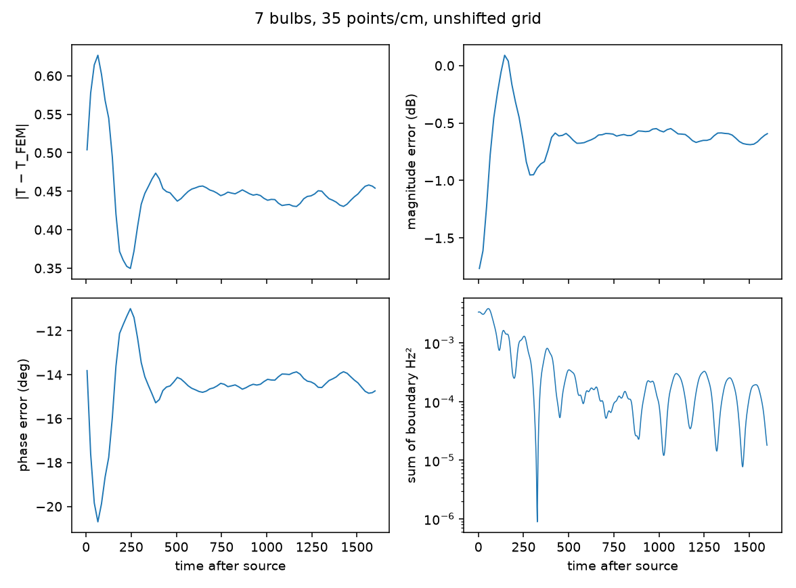
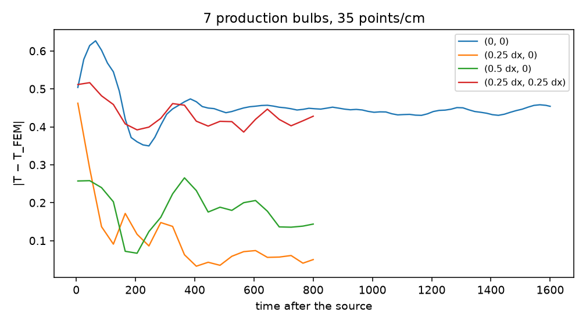

# Seven-bulb long-time convergence

**BOTH_TEMPORAL_AND_SPATIAL**
**GRID_REGISTRATION_DOMINANT**
**SPATIAL_INTERFACE_ERROR_DOMINANT**

The seven-bulb Meep solution at 35 points/cm does not return to the FEM result if it is left on the original grid. After the early transient, the forward-ratio error oscillates about |Δ| ≈ 0.45 (−0.6 dB, −15°) from 400 through 1600 time units after the source. Shifting the entire physical problem by 0.25 cell, with bulb spacing unchanged, drops that late error to about 0.05. The late fields are mirror-paired copies of local boundary modes, not one collective cluster eigenvalue. No 19-bulb, 91-bulb, or 50 points/cm seven-bulb run was launched. B = 0. Production code was not changed.

## Prior result, preserved

The earlier short run is untouched:

- `dft_cluster7_ppc35_ox0_oy0_u80_disk_ckpt.jsonl`
- `dft_cluster7_ppc35_ox0_oy0_u80_vac_ckpt.jsonl`
- `dft_cluster7_ppc35_ox0_oy0_u80.json`
- `fem_cluster7.json` (FEM-F forward ratio −0.06621 + 1.76883i, phase 92.14°, |T| = 1.770)
- `cluster7_centers.json`

Recomputed from that file: at t = 274.67, which is 80 time units after the source, |Δ| = 0.597, −0.49 dB, phase error −19.7°. The long run uses the same centers, the same Drude parameters, the same point source, the same monitor line, and the same unshifted registration. At the overlapping checkpoint t = 240 both files give |Δ| = 0.6142.

The source ends at t = 194.67. Post-source time below is Meep time minus that instant. Resolution remains points per centimeter: 35 points/cm is dx = 0.286 mm and Meep resolution 70.

## Does the original registration approach FEM?

No. Classification: the error oscillates about a nonzero plateau.

| time after source | \|Δ\| | magnitude | phase error |
|---:|---:|---:|---:|
| 5 | 0.504 | −1.77 dB | −13.8° |
| 45 | 0.614 | −1.23 dB | −19.8° |
| 85 | 0.602 | −0.45 dB | −19.9° |
| 245 | 0.350 | −0.63 dB | −11.0° |
| 405 | 0.466 | −0.62 dB | −15.1° |
| 805 | 0.448 | −0.60 dB | −14.5° |
| 1205 | 0.440 | −0.67 dB | −14.2° |
| 1600 | 0.454 | −0.59 dB | −14.7° |

From 1000 to 1600 time units after the source, |Δ| stays inside 0.430–0.458, the magnitude error inside −0.69 to −0.55 dB, and the phase error inside −14.8° to −13.9°. The early swing (0.50 → 0.63 → 0.35) is the transient. The center of the later oscillation is the steady error. It is not drifting toward zero, so the asymptote is that band, not a fit through a slope.

The backscattered ratio at x = −3 has a smaller late error, |ΔR| ≈ 0.04 at the last checkpoint. The forward ratio carries the discrepancy.

Boundary energy, the sum of Hz² on the seven plasma-edge probes, falls from 2.2×10⁻³ (200–400) to 1.3×10⁻⁴ (1400–1790) and is still inching down. The DFT error is already flat while that energy decays, so the leftover field is off the 3.85 GHz bin.

## Grid registration

The whole cluster, source, and monitors were shifted together. Spacing was not changed. FEM is the same continuum value.

| shift | late \|Δ\| | late magnitude | late phase | loudest boundary mode |
|---|---:|---:|---:|---|
| (0, 0), to post = 1600 | 0.43–0.46 | −0.6 dB | −15° | 3.793 GHz, Q = 121, amp 0.031 |
| (0.25 dx, 0), post = 400–800 | 0.033–0.074 | −0.06 dB at post = 800 | +1.6° | 3.890 GHz, Q = 112, amp 0.042 |
| (0.5 dx, 0), post = 700–800 | 0.14–0.21 | −0.13 dB | −4.6° | 3.795 GHz, Q = 333, amp 0.018 |
| (0.25 dx, 0.25 dx), post = 600–800 | 0.40–0.45 | −1.11 dB | −12.8° | 3.880 GHz, Q = 96, amp 0.038 |

The late complex error changes by about a factor of nine between the worst and best of these four alignments. On the best alignment the Q = 112 mode is only 40 MHz above 3.85 GHz, and by post = 800 it has had about six decay times, so the remaining |Δ| ≈ 0.05 is a steady residual of that registration, not an unfinished ringdown. A 50 points/cm seven-bulb run was not started: the same grid already produces both the 0.45 plateau and the 0.05 plateau.

## Late modes on all seven bulbs

Harminv on a probe 2 dx outside each plasma core, unshifted, `until_after_sources = 600`. Mirror pairs agree to the printed digits: bulbs at (0, ±1), bulbs at (+0.866, ±0.5), and bulbs at (−0.866, ±0.5). That is the symmetry of a source on the x axis.

The loudest fits are not one frequency:

| bulbs | frequency | Q | amplitude |
|---|---:|---:|---:|
| x = +0.866 | 3.793 GHz | 121 | 0.031 |
| center | 3.804 GHz | 228 | 0.016 |
| y = ±1 | 3.799 GHz | 277 | 0.013 |
| x = −0.866 | 3.808 GHz | 709 | 0.0049 |

A second family sits at 3.61–3.68 GHz, which is where the single coated bulb rings at this same 35 points/cm resolution (3.621 GHz, Q = 308, amplitude 0.0025). Weaker fits reach Q ≈ 1100 at amplitudes below 0.002, and only on one mirror pair.

A collective cluster eigenvalue would be one frequency and one Q on every bulb. These frequencies differ by bulb, and the high-Q fits do not appear on all seven. They are local interface modes, retuned by each circle's position on the Yee grid, with amplitudes set by the illumination. At 35 points/cm the pitch is 70 cells, so the bulbs at (0, ±1) share the center bulb's registration, while the bulbs at x = ±0.866 a sit 0.62 cell away in x. One global shift cannot put all seven circles on the same staircase.

The loudest Q is 121, below the single-bulb Q of 308. Q does not grow with bulb count for the mode that dominates the trace. The higher-Q fits are weaker and still local.

## Staircase geometry

Meep's own cylinder test, on the Ex, Ey, and Hz sample points of this 35 points/cm grid. Represented plasma area is within −1.2% to +0.5% of πR² on every bulb and every offset that was checked. Centroids lie within 0.03 mm of the true centers; dx is 0.286 mm.

Those area errors do not add up to the scattering error. The two bulbs at x = +0.866 and the two at x = −0.866 have the same Ex area error (−0.53%) and opposite centroid shifts of 0.020 mm. Their late Hz rms values, after t = 1500, are 3.5×10⁻³ and 5.9×10⁻³. Equal area error, unequal ring. The global error follows the registration of the curved Drude surface, not a sum of area deficits.

## What this says about the 91-bulb runs

Measured:

- On this seven-bulb cluster, `run_time = 20` stops during the transient. At 5–45 time units after the source, |Δ| is 0.50–0.61 and still moving. The settled value is also wrong on the default grid.
- Running longer, alone, does not recover FEM on that grid. The offset that remains is spatial.
- A sub-cell shift of the same geometry changes the settled error from 0.45 to 0.05. The 25 → 35 → 50 change in the full device is the same kind of effect already measured on one disk, where refining the grid walked the boundary mode onto 3.85 GHz and made a short DFT worse.

Extrapolated, and not a 91-bulb calculation:

- A hex lattice does not give every circle the same fractional alignment. The seven-bulb result says a persistent spatial offset should be expected at infinite time, and that one runtime increase will not remove it.
- The settled seven-bulb error is about 0.6 dB in magnitude. The existing 91-bulb port discrepancies are several dB, and larger than that on one port. This cluster does not numerically account for that gap. It does say the gap should not be read as an unfinished transient of a mode whose Q simply grows with N.

## Answers

1. On the original 35 points/cm registration, no.
2. There is no convergence time to FEM on that registration. The transient has died by about 400 time units after the source, and the error remains.
3. Late residual: |Δ| = 0.43–0.46, −0.55 to −0.69 dB, phase −13.9° to −14.8°, over post-source times 1000–1600.
4. Yes. The same cluster gives late |Δ| ≈ 0.45, 0.05, 0.14, and 0.43 on the four registrations above.
5. Single-bulb-like. Mirror pairs match. Different bulb classes ring at different frequencies. Not one collective mode.
6. No. The loudest seven-bulb Q is 121, against 308 for one coated bulb at the same resolution. A few weaker local fits reach Q ~ 10³.
7. No. Twenty time units after the source is still inside the transient, and the settled DFT is registration-dependent and not the FEM value.
8. On one disk, yes: refining from 35 to 50 points/cm moved the boundary mode from 221 MHz below 3.85 GHz onto 45 MHz above it. The seven-bulb runs add a second fact at fixed resolution: bulbs that the lattice places on different fractional cells already disagree with each other, so a finer grid is not uniformly a better interface.
9. Yes. FEM matches the Mie series on the bare disk, and Meep approaches that FEM cluster result only for a favorable registration.
10. Next: the same seven production shells and the same source, with the circular plasma cores replaced by equal-area squares, Meep against a body-fitted FEM at 35 points/cm, checkpointed for a few hundred time units after the source. If the squares settle on FEM and the circles stay at |Δ| ≈ 0.45, the curved Drude staircase is the cluster error. Do not run 19 or 91 bulbs before that.
