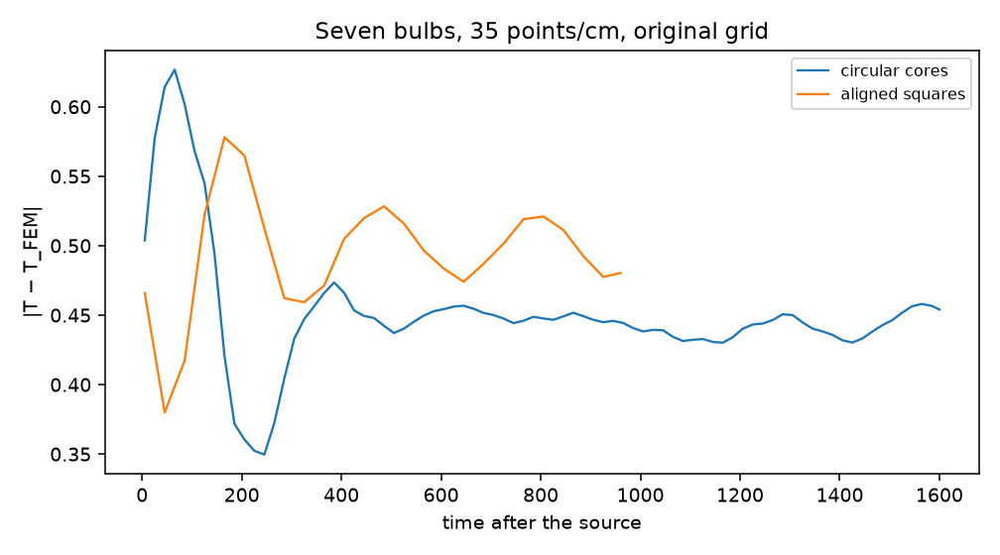

# Inscribed-square plasma-core control

**NONCURVATURE_ERROR_REMAINS**

Seven axis-aligned inscribed squares, in the same quartz shells and on the same 35 points/cm grid, do not bring Meep back to the body-fitted FEM solution. On the original registration the late forward error is |Δ| ≈ 0.48, −1.1 dB, and −15°, with a boundary mode at 3.90 GHz and Q ≈ 800. That is as large as the circular-core plateau, and the Q is higher. A sub-cell shift still moves the error from about 0.12 to 0.90.

One square, alone, is a different result. It settles within a few time units of the source turning off, Harminv finds no high-Q ring, and the forward error stays at |Δ| = 0.059 (−0.15 dB, −2.9°). Rotating that one square by 45° raises the error to |Δ| = 0.108 (+0.18 dB, +5.3°) and adds only a weak Q ≈ 34 mode. A quarter-cell shift does not change the rotated single-square error. The large, registration-sensitive failure appears when seven interfaces share the array. It does not require a curved plasma boundary.

No 19-bulb, 91-bulb, 50 points/cm, or B ≠ 0 run was made. Production code was not changed. Nothing was committed.

## Geometry

The production plasma radius is R = 0.230 a = 4.60 mm. The square is the one inscribed in that circle: side L = √2 R = 0.3253 a = 6.505 mm. The four corners lie on the original plasma circle. The side was not shortened.

| quantity | value |
|---|---:|
| circle area | 0.1662 a² |
| square area | 0.1058 a² |
| square/circle area | 2/π = 0.637 |
| quartz inner radius | 0.325 a |
| clearance, corner to quartz | 0.095 a = 1.9 mm |
| overlap with quartz | none |

The quartz shell and the vacuum gap are the production ones. Plasma fills the square only. Mesh areas on the FEM-F grid match the square area and the quartz annulus to 1e−9 a². Circle and square scattering are different physics; every error below is Meep minus the FEM solution of that same shape.

## Seven-square FEM reference

The square corners of this negative-ε core converge slowly. Four body-fitted levels, same operator and PML as the circular study:

| level | h | edge spacing | DOFs | \|T\| | phase |
|---|---:|---:|---:|---:|---:|
| FEM-C | 0.030 | 0.012 | 485,314 | 1.741 | 86.6° |
| FEM-F | 0.018 | 0.007 | 1,345,989 | 1.772 | 92.1° |
| FEM-X | 0.012 | 0.004 | 3,028,102 | 1.790 | 96.5° |
| FEM-Y | 0.009 | 0.003 | 5,380,106 | 1.796 | 98.8° |

The last step, FEM-X to FEM-Y, is +0.032 dB, |Δ| = 0.072, and +2.3°. The phase steps are +5.5°, +4.4°, +2.3°. FEM-Y, T = −0.274 + 1.775i, is the reference used below. Its remaining uncertainty is a few degrees, much smaller than the 15° Meep offset on the original grid.

One square converges without that climb. FEM-C to FEM-F is +0.039 dB, |Δ| = 0.016, and +0.8° (1.34 million DOFs on the fine mesh). The rotated single square is +0.036 dB, |Δ| = 0.016, and +0.8°.

## Seven aligned squares in Meep

Same 35 points/cm grid, same source, monitors, and registration as the circular long run. Compared with FEM-Y:

| time after source | \|Δ\| | magnitude | phase error |
|---:|---:|---:|---:|
| 45 | 0.380 | −1.12 dB | −10.6° |
| 165 | 0.578 | −1.02 dB | −18.4° |
| 485 | 0.528 | −1.14 dB | −16.4° |
| 805 | 0.521 | −1.17 dB | −16.1° |
| 960 | 0.480 | −1.07 dB | −14.7° |

From 700 to 960 time units after the source, |Δ| stays inside 0.48–0.52. It is oscillating about that plateau, not decaying toward FEM-Y.



Harminv on the face probes, `until_after_sources = 400`. Mirror pairs match.

| bulbs | frequency | Q | amplitude |
|---|---:|---:|---:|
| x = −0.866 | 3.900 GHz | 796 | 0.026 |
| center | 3.903 GHz | 331 | 0.022 |
| x = +0.866 | 3.903 GHz | 139 | 0.018 |
| y = ±1 | 3.901 GHz | 500 | 0.0089 |

The loudest Q is 796, above the circular cluster's loudest Q of 121 and above the single coated bulb's Q of 308. The mode sits 50 MHz above 3.85 GHz. The curved-boundary ring did not disappear. It moved onto the target and its Q rose.

## Registration of the seven aligned squares

| shift | late \|Δ\| | magnitude | phase | loudest mode |
|---|---:|---:|---:|---|
| (0, 0), to post = 960 | 0.48 | −1.07 dB | −14.7° | 3.900 GHz, Q = 796 |
| (0.25 dx, 0), post = 480 | 0.20 | −0.09 dB | +6.5° | 4.131 GHz, Q = 53 |
| (0.5 dx, 0), post = 480 | 0.90 | −1.20 dB | +30° | 3.861 GHz, Q = 45 |
| face-snapped, −0.384 dx | 0.12 | −0.58 dB | +0.2° | 3.891 GHz, Q = 74 |

The −0.384 dx shift puts the vertical faces of the on-axis squares on a Yee plane. The bulbs at x = ±0.866 a stay 0.62 cell off that plane, because the lattice pitch is not an integer number of cells in x. Even that best global alignment leaves |Δ| = 0.12. The circular cluster's registration span was about 0.05–0.45. The square span is about 0.12–0.90. Straight, axis-parallel faces are not less sensitive.

## One square

Aligned, original grid, settled for every checkpoint from 5 to 480 time units after the source:

|Δ| = 0.059, −0.15 dB, −2.9°. The only Harminv fit has Q = 1 and amplitude 8×10⁻⁶.

Rotated 45° about the same center, same side length:

|Δ| = 0.108, +0.18 dB, +5.3°, settled by 165 time units. Loudest mode 4.043 GHz, Q = 34, amplitude 0.009. Shifting that single diamond by 0.25 dx leaves the error and the mode unchanged at the printed digits.

One straight interface does not reproduce the seven-bulb failure. One oblique interface is mildly worse and is not registration-sensitive at a quarter cell. Seven axis-parallel squares are.

## Numerical error, seven bulbs, original grid

| | circular | aligned square |
|---|---:|---:|
| late Meep–FEM \|Δ\| | 0.45 | 0.48 |
| magnitude | −0.6 dB | −1.1 dB |
| phase | −15° | −15° |
| largest late Q | 121 | 796 |
| dominant frequency | 3.79 GHz | 3.90 GHz |
| dominant amplitude | 0.031 | 0.026 |
| time to settle | ~400, then a plateau | plateau by ~400, still rocking at 960 |
| registration span of \|Δ\| | 0.05–0.45 | 0.12–0.90 |

Replacing the curve with a straight axis-parallel Drude face does not reduce the seven-bulb error, the late Q, or the registration spread.

## What this says about the 91-bulb Meep runs

Measured:

1. At 35 points/cm, Meep is not a reliable 0.1 dB reference for a curved plasma rod inside this seven-bulb cluster, and it is also not one for the same cluster with straight plasma faces. One isolated square is within 0.15 dB.
2. Sub-cell registration moves the seven-square error by several tenths in |Δ| and by tens of degrees. That is larger than a 0.1 dB validation tolerance.
3. On the bare disk, going from 35 to 50 points/cm moved the boundary mode onto 3.85 GHz and made the short DFT worse. Finer resolution is not a monotone improvement. No 50 points/cm square was run, because the 35 points/cm seven-square result had not agreed with FEM.
4. Body-fitted FEM matches the Mie series on the circular disk. For seven squares the FEM phase is still moving by about 2° on the last refinement, so that reference is not finished, but the Meep offset on the original grid is several times larger.
5. Of the existing 91-bulb discrepancy: a run of length 20 stops during the transient, which is measured on both the circles and the squares. A steady, registration-dependent offset remains after the transient, and it remains when the plasma boundary is straight. That accounts for a persistent spatial error. It does not supply a number for the multi-dB 91-bulb port gaps. Those gaps are larger than the settled seven-bulb plateau of about 1 dB, so part of the device discrepancy is still unresolved.
6. Nothing here is a B ≠ 0 result. Magnetized plasma, adjoints, and optimization are untouched.

## Next experiment

Give each of the seven squares its own sub-cell shift, smaller than one cell, so that every vertical and horizontal face lies on a Yee plane. Keep the quartz shells and the source fixed to those shifted centers. Compare that Meep run with a body-fitted FEM of the same shifted squares, at 35 points/cm, for a few hundred time units after the source. If that pair agrees and the production-centered squares do not, the cluster error is the off-grid flat Drude face. If it still disagrees, the error survives even when every straight interface is grid-snapped, and the next place to look is multiple scattering of the Drude cores rather than staircasing.

## Git status for the next checkpoint

`git diff --stat` for the only tracked edit:

```
scripts/validation/fem_meep_validation/plasma_ring_campaign.py | 165 ++++++++++++++++++---
1 file changed, 148 insertions(+), 17 deletions(-)
```

Branch `agent/eigenmode-ports`, even with origin before this campaign. New untracked campaign outputs include `SQUARE_CORE_CONTROL.md`, `square_vs_circle_error.png`, `square_core_geometry.json`, `fem_cluster7_square.json`, `fem_cluster1_square.json`, `fem_cluster1_diamond.json`, and the Meep JSON/JSONL checkpoints. Field dumps (`*.npz`), the old raw trace, logs, `_vendor/`, and `.conda_envs/` are still untracked and should stay out of the next commit.
